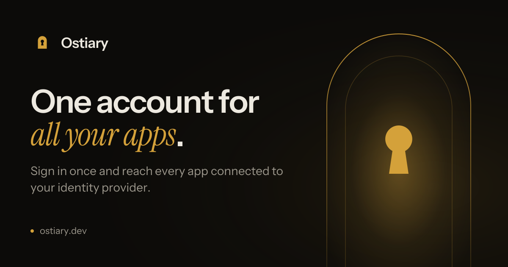
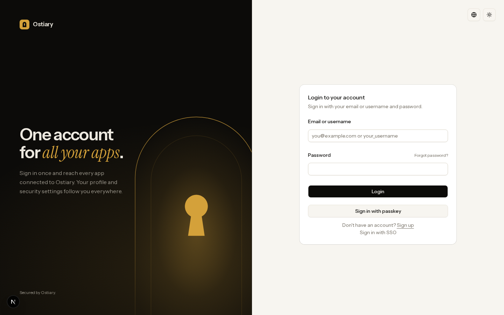

<p align="center">
  
</p>

<h1 align="center">Ostiary</h1>

<p align="center">
  <strong>A self-hosted, open-source alternative to Auth0, built on <a href="https://www.better-auth.com">Better Auth</a>.</strong><br>
  One sign-in for all your apps: OAuth 2.1 and OpenID Connect provider, passkeys, enterprise SSO,<br>
  organizations and an admin console. Your users, your database, no per-user pricing.
</p>

<p align="center">
  <a href="https://www.ostiary.dev"><strong>Website</strong></a> ·
  <a href="https://demo.ostiary.dev"><strong>Live demo</strong></a> ·
  <a href="#deploy">Deploy</a> ·
  <a href="#connect-an-app">Connect an app</a>
</p>

<p align="center">
  <a href="https://vercel.com/new/clone?repository-url=https%3A%2F%2Fgithub.com%2Fflorianamette%2Fostiary%2Ftree%2Fmain%2Fapps%2Fauth&project-name=ostiary&repository-name=ostiary&env=BETTER_AUTH_SECRET%2CADMIN_EMAILS%2CRESEND_API_KEY%2CRESEND_FROM&envDescription=BETTER_AUTH_SECRET%3A%2032%2B%20random%20characters%20%28openssl%20rand%20-base64%2032%29.%20ADMIN_EMAILS%3A%20your%20email%2C%20to%20become%20admin%20on%20sign-up.%20RESEND_%2A%3A%20an%20API%20key%20and%20sender%20from%20resend.com%2C%20for%20verification%20emails.&envLink=https%3A%2F%2Fgithub.com%2Fflorianamette%2Fostiary%23configuration&stores=%5B%7B%22type%22%3A%22integration%22%2C%22integrationSlug%22%3A%22neon%22%2C%22productSlug%22%3A%22neon%22%2C%22protocol%22%3A%22storage%22%7D%5D"></a>
</p>

> In the Middle Ages the *ostiarius* was the doorkeeper: the one who held the keys and decided who came in.

<picture>
  <source media="(prefers-color-scheme: dark)" srcset=".github/assets/sign-in-dark.png">
  
</picture>

## Why

Hosted identity platforms are great until the bill scales with your users or you need your user data in your own database. Ostiary gives you the same building blocks as a deployable Next.js app you own:

- **Standard protocols.** Any app that speaks OpenID Connect signs in with Ostiary: Next.js, Remix, mobile apps, CLIs, APIs.
- **Your data.** Everything lives in your Postgres database. No vendor lock-in.
- **No per-user pricing.** It costs what your hosting costs.
- **Readable code.** A small TypeScript monorepo on top of [Better Auth](https://www.better-auth.com), not a black box.

## Features

**For your users**

- Email and password with verification, username sign-in, password reset
- Passkeys (WebAuthn), plus a recent sign-in required to add one
- Social sign-in (GitHub included; others are a config entry)
- Enterprise SSO (OIDC), with DNS domain verification
- Account dashboard: profile, email change (approved from the current inbox), sessions, passkeys, connected accounts, authorized apps
- 20 locales, light and dark themes

**For your apps**

- OAuth 2.1 / OpenID Connect provider: discovery, PKCE, refresh tokens, consent, UserInfo, introspection, JWKS
- Machine-to-machine tokens (client credentials) with per-client scopes
- Protected resources: JWT access tokens scoped to your APIs, with the user's role as a claim
- Organizations with members, roles and invitations

**For you (admin console)**

- Users: search, roles, bans, sessions, impersonation
- OAuth clients with usage statistics, consents, organizations, SSO providers
- Audit log of every admin action, sign-in activity and failed sign-in monitoring

## How it compares

| | Ostiary | Auth0 |
| --- | --- | --- |
| Hosting | Your Vercel account and Postgres | Auth0 cloud |
| Pricing | Your infrastructure | Per monthly active user |
| OIDC / OAuth 2.1 provider | Yes | Yes |
| Passkeys, social sign-in, organizations | Yes | Yes |
| Enterprise SSO | OIDC (SAML via Better Auth) | OIDC and SAML |
| Admin console and audit log | Yes | Yes |
| SCIM, breached-password detection, compliance certifications | Not yet | Yes |
| Source code | Yours, MIT | Closed |

Ostiary is a good fit when you want to own your identity layer. If you need a managed service with compliance certifications and an SLA, a hosted platform is the better choice.

## Deploy

1. Click **Deploy with Vercel** above. Vercel creates a Neon Postgres database for you and asks for:
   - `BETTER_AUTH_SECRET`: 32+ random characters (`openssl rand -base64 32`)
   - `ADMIN_EMAILS`: your email address, so your account becomes an admin when you sign up
   - `RESEND_API_KEY` and `RESEND_FROM`: from [resend.com](https://resend.com), to send verification emails
2. The build applies the database migrations. When it finishes, open your deployment and sign up with the email you put in `ADMIN_EMAILS`.
3. Optional: deploy the admin console as a second project with the same database and secret:

   <a href="https://vercel.com/new/clone?repository-url=https%3A%2F%2Fgithub.com%2Fflorianamette%2Fostiary%2Ftree%2Fmain%2Fapps%2Fadmin&project-name=ostiary-admin&repository-name=ostiary&env=DATABASE_URL%2CBETTER_AUTH_SECRET%2CAUTH_APP_URL%2CADMIN_APP_URL%2CRESEND_API_KEY%2CRESEND_FROM&envDescription=Use%20the%20same%20DATABASE_URL%20and%20BETTER_AUTH_SECRET%20as%20your%20Ostiary%20auth%20app.%20AUTH_APP_URL%3A%20its%20URL.%20ADMIN_APP_URL%3A%20this%20app%27s%20URL.&envLink=https%3A%2F%2Fgithub.com%2Fflorianamette%2Fostiary%23configuration"></a>

   For a single sign-in across both apps, give them subdomains of one domain (for example `auth.example.com` and `admin.example.com`) and set `COOKIE_DOMAIN=.example.com` on both.

## Connect an app

Ostiary is a standard OpenID Connect provider. Register a client in the admin console (**Applications**), then point your app at the discovery document:

```
https://<your-ostiary-domain>/api/auth/.well-known/openid-configuration
```

For example, with [Auth.js](https://authjs.dev) in a Next.js app:

```ts
import NextAuth from "next-auth";

export const { handlers, auth, signIn, signOut } = NextAuth({
  providers: [
    {
      id: "ostiary",
      name: "Ostiary",
      type: "oidc",
      issuer: "https://auth.example.com/api/auth",
      clientId: process.env.OSTIARY_CLIENT_ID,
      clientSecret: process.env.OSTIARY_CLIENT_SECRET,
    },
  ],
});
```

Any OIDC library works the same way (Better Auth's generic OAuth, `openid-client`, AppAuth on mobile): give it the issuer, client ID and secret.

To protect an API, register it in the admin console under **APIs**: its identifier (usually its URL) and the scopes clients may request for it. Clients request a token for it with the `resource` parameter, and the API verifies the JWT against Ostiary's JWKS. New scopes reach the auth server within a minute, no redeploy needed. You can also declare APIs with `OAUTH_API_AUDIENCES` and scopes with `OAUTH_API_SCOPES`, for example to provision a new instance.

## Run locally

Requirements: Node.js 20+, pnpm 11, a Postgres database.

```bash
pnpm install
cp apps/auth/.env.example apps/auth/.env.local     # fill in DATABASE_URL and BETTER_AUTH_SECRET
cp apps/admin/.env.example apps/admin/.env.local   # same DATABASE_URL and BETTER_AUTH_SECRET
pnpm db:migrate
pnpm dev:auth     # http://localhost:3000
pnpm dev:admin    # http://localhost:3001
```

Without Resend configured, development prints verification and reset links to the console.

## Configuration

| Variable | App | Required | Purpose |
| --- | --- | --- | --- |
| `DATABASE_URL` | both | yes | Postgres connection string (the same for both apps) |
| `BETTER_AUTH_SECRET` | both | yes | 32+ characters, the same for both apps |
| `RESEND_API_KEY`, `RESEND_FROM` | both | in production | Sending verification, reset and invitation emails |
| `ADMIN_EMAILS` | auth | first run | Emails that become admins when they sign up |
| `AUTH_APP_URL`, `ADMIN_APP_URL` | both | admin console | The two apps' public URLs |
| `NEXT_PUBLIC_ADMIN_APP_URL` | auth | admin console | Shows the "Admin" link in the account menu |
| `COOKIE_DOMAIN` | both | admin console | Parent domain shared by both apps, e.g. `.example.com` |
| `OAUTH_API_AUDIENCES` | both | optional | Comma-separated URLs of your APIs, registered at build time (or use the admin console) |
| `OAUTH_API_SCOPES` | both | optional | Comma-separated scopes available to every API (or declare them per API in the admin console) |
| `GITHUB_CLIENT_ID`, `GITHUB_CLIENT_SECRET` | auth | optional | "Sign in with GitHub" |

**Rebrand** by editing `packages/core/src/lib/brand.ts` (name, tagline, colors, logo geometry) and the matching tokens in `packages/core/src/styles/globals.css`, then run `pnpm --filter @ostiary/auth brand:assets` to regenerate `logo.png` and `logo.svg`.

## Architecture

```
apps/auth       Sign-in, sign-up, consent, OIDC endpoints, account dashboard
apps/admin      Admin console (optional): users, clients, organizations, SSO, audit
packages/core   Better Auth configuration, database schema and migrations, emails, UI, translations
```

Both apps run the same Better Auth configuration against one database. The admin app only exposes an allowlist of auth endpoints; sign-in and the OIDC protocol stay on the auth app.

## Security

- Email changes need approval from the current inbox; a stolen session alone cannot move an account.
- Adding a passkey or connecting an account needs a sign-in from the last 10 minutes.
- Only admins can create organizations and register SSO providers; SSO domains must be verified with a DNS record.
- The audit log never stores passwords, secrets or session tokens.

Found a vulnerability? Please email the maintainer rather than opening a public issue.

## In production

[Cyber Auth](https://www.cyberauth.co), the single sign-on for the Cyber ecosystem (CyberCTF, Cyber Courses, Cyber Bench), runs on Ostiary.

## Credits

Built on [Better Auth](https://www.better-auth.com) (MIT). Ostiary is a community project and is not affiliated with Better Auth. Type: [Instrument Sans and Instrument Serif](https://github.com/Instrument) and [Geist Mono](https://vercel.com/font) (SIL Open Font License).

## License

[MIT](LICENSE) © Florian Amette
